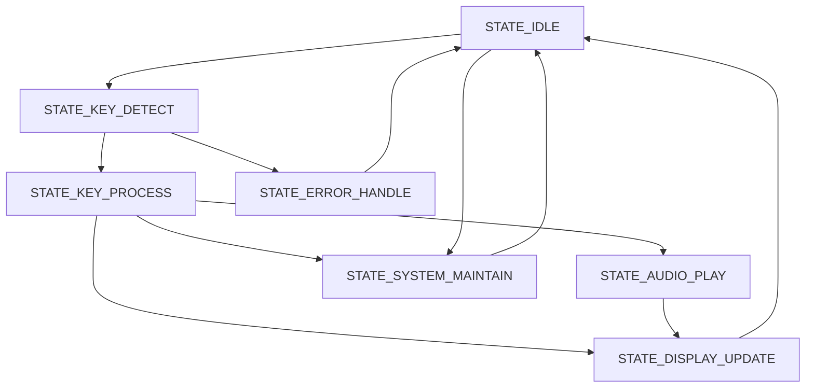

# 键盘钢琴项目 - 状态机版本

基于STM32F4的ZLG7290键盘钢琴实现，采用状态机架构，解决了原有代码中重复I2C读取的问题，提高了系统的可维护性和可靠性。

## 🎯 状态机改进特性

### 1. 解决重复I2C读取问题
- **原问题**: 主循环中存在两次I2C读取（中断触发 + 50ms轮询）
- **解决方案**: 统一的事件检测机制，避免重复读取
- **效果**: 减少I2C总线负载，提高通信效率

### 2. 清晰的状态管理
- **分离关注点**: 每个状态只处理特定的功能
- **可预测性**: 状态转换逻辑清晰，便于调试
- **可维护性**: 新增功能只需添加相应状态和事件

### 3. 健壮的错误处理
- **重试机制**: I2C通信失败时的重试逻辑
- **错误隔离**: 专门的错误处理状态
- **故障恢复**: 自动恢复到正常状态

## 📊 状态机架构

### 系统状态
```c
typedef enum {
    STATE_IDLE,           // 空闲状态 - 等待事件
    STATE_KEY_DETECT,     // 按键检测状态 - 读取I2C按键值
    STATE_KEY_PROCESS,    // 按键处理状态 - 处理按键逻辑
    STATE_AUDIO_PLAY,     // 音频播放状态 - 处理音频输出
    STATE_DISPLAY_UPDATE, // 显示更新状态 - 更新显示内容
    STATE_SYSTEM_MAINTAIN,// 系统维护状态 - 保存状态、维护
    STATE_ERROR_HANDLE    // 错误处理状态 - 处理各种错误
} SystemState_t;
```

### 系统事件
```c
typedef enum {
    EVENT_NONE,           // 无事件
    EVENT_KEY_INTERRUPT,  // 按键中断事件
    EVENT_TIMER_50MS,     // 50ms定时器事件
    EVENT_TIMER_100MS,    // 100ms定时器事件
    EVENT_TIMER_5S,       // 5秒定时器事件
    EVENT_I2C_SUCCESS,    // I2C通信成功事件
    EVENT_I2C_ERROR,      // I2C通信错误事件
    EVENT_KEY_PRESS,      // 按键按下事件
    EVENT_KEY_RELEASE,    // 按键释放事件
    EVENT_AUDIO_START,    // 音频开始事件
    EVENT_AUDIO_STOP      // 音频停止事件
} SystemEvent_t;
```

## 🔄 状态转换流程



### 详细状态转换规则

1. **STATE_IDLE → STATE_KEY_DETECT**
   - 按键中断事件
   - 50ms定时器事件（轮询检测）

2. **STATE_KEY_DETECT → STATE_KEY_PROCESS**
   - I2C通信成功

3. **STATE_KEY_DETECT → STATE_ERROR_HANDLE**
   - I2C通信失败且超过重试次数

4. **STATE_KEY_PROCESS → STATE_AUDIO_PLAY**
   - 音符键按下

5. **STATE_KEY_PROCESS → STATE_DISPLAY_UPDATE**
   - 清空键按下

6. **STATE_KEY_PROCESS → STATE_SYSTEM_MAINTAIN**
   - 按键释放

## 📁 代码结构

```
2_Beep/
├── Src/
│   ├── main.c              # 主程序，集成状态机
│   ├── state_machine.c     # 状态机核心实现
│   ├── zlg7290.c          # ZLG7290键盘控制器驱动
│   ├── i2c.c              # I2C接口配置
│   └── gpio.c             # GPIO配置
├── Inc/
│   ├── state_machine.h    # 状态机头文件
│   ├── zlg7290.h          # ZLG7290驱动头文件
│   └── i2c.h              # I2C接口头文件
├── README.md              # 原项目说明
├── README_StateMachine.md # 状态机版本说明
└── StateMachine_Design.md # 状态机设计文档
```

## 🔧 主要改进点

### 1. 简化的主循环
```c
// 原版本: 复杂的嵌套判断和重复I2C读取
while (1) {
    if(key_flag == 1) {
        // 中断触发的I2C读取
        // ... 复杂的按键处理逻辑
    }
    
    // 50ms轮询的I2C读取
    if(current_time - last_poll_time > 50) {
        // ... 重复的按键处理逻辑
    }
    
    // ... 其他重复的定时器检查
}

// 状态机版本: 清晰简洁
while (1) {
    StateMachine_Run();
    IWDG_SystemTask();
    // 简单延时
}
```

### 2. 统一的事件检测
```c
SystemEvent_t StateMachine_GetEvent(void) {
    // 按优先级检测事件
    if(key_flag == 1) return EVENT_KEY_INTERRUPT;
    if(timer_50ms_expired) return EVENT_TIMER_50MS;
    if(timer_100ms_expired) return EVENT_TIMER_100MS;
    if(timer_5s_expired) return EVENT_TIMER_5S;
    return EVENT_NONE;
}
```

### 3. 专门的状态处理函数
每个状态都有独立的处理函数，职责明确：
- `State_Idle_Handler()`: 空闲状态处理
- `State_KeyDetect_Handler()`: 按键检测处理
- `State_KeyProcess_Handler()`: 按键逻辑处理
- `State_AudioPlay_Handler()`: 音频播放处理
- `State_DisplayUpdate_Handler()`: 显示更新处理
- `State_SystemMaintain_Handler()`: 系统维护处理
- `State_ErrorHandle_Handler()`: 错误处理

## 🚀 性能优化

### 1. CPU利用率优化
- **事件驱动**: 只在有事件时才执行相应处理
- **避免重复**: 消除了重复的I2C读取操作
- **状态缓存**: 状态机内部维护按键状态，减少重复计算

### 2. I2C通信优化
- **单次读取**: 每次事件只进行一次I2C读取
- **智能重试**: 在专门的状态中处理重试逻辑
- **错误隔离**: 错误不会影响正常的业务流程

### 3. 内存使用优化
- **紧凑结构**: 状态机上下文结构设计紧凑
- **复用缓冲区**: 按键检测使用统一的缓冲区
- **静态分配**: 避免动态内存分配

## 🔍 调试支持

### 启用调试模式
在编译时定义 `DEBUG_STATE_MACHINE` 宏来启用调试输出：
```c
#define DEBUG_STATE_MACHINE
```

### 调试输出示例
```
State Machine Initialized
State: 0 -> 1, Event: 1  // IDLE -> KEY_DETECT, KEY_INTERRUPT
State: 1 -> 2, Event: 5  // KEY_DETECT -> KEY_PROCESS, I2C_SUCCESS
State: 2 -> 3, Event: 9  // KEY_PROCESS -> AUDIO_PLAY, KEY_PRESS
State: 3 -> 4, Event: 10 // AUDIO_PLAY -> DISPLAY_UPDATE, AUDIO_START
State: 4 -> 0, Event: 0  // DISPLAY_UPDATE -> IDLE, NONE
```

## 📈 扩展能力

状态机架构具有良好的扩展性：

### 1. 新增状态
- 音量控制状态
- 设置菜单状态
- 录音回放状态

### 2. 新增事件
- 触摸屏事件
- 网络通信事件
- 定时任务事件

### 3. 复杂功能
- 状态历史记录
- 状态预测算法
- 多状态机协作

## 🧪 测试验证

### 功能测试
1. **按键响应测试**: 验证所有按键（1-9, 0）的正确响应
2. **音频播放测试**: 验证音符的准确播放
3. **显示功能测试**: 验证数码管显示的正确性
4. **热启动测试**: 验证断电重启后的状态恢复

### 性能测试
1. **响应时间**: 测量按键按下到音频输出的延迟
2. **I2C效率**: 监控I2C通信的成功率和重试次数
3. **CPU占用**: 测量系统的CPU利用率

### 稳定性测试
1. **长时间运行**: 24小时连续运行测试
2. **I2C错误恢复**: 模拟I2C错误并验证恢复机制
3. **中断压力测试**: 高频按键操作测试

## 🎵 使用方法

### 硬件连接
按照原项目README.md中的硬件连接说明进行连接。

### 编译和下载
1. 使用STM32CubeMX打开 `Beep.ioc` 文件
2. 重新生成代码（保持现有的配置）
3. 在Keil中编译项目
4. 下载到STM32F4开发板

### 操作说明
1. **播放音符**: 按键1-9播放对应的音符
2. **清空显示**: 按键0清空数码管显示
3. **热启动**: 在播放过程中重启设备，系统自动恢复

## 📋 注意事项

1. **编译配置**: 确保项目包含了新增的 `state_machine.c` 和 `state_machine.h` 文件
2. **调试模式**: 生产环境中请关闭 `DEBUG_STATE_MACHINE` 宏以提高性能
3. **内存需求**: 状态机增加了少量内存开销，但在STM32F4上完全可接受
4. **向后兼容**: 保持了原有的所有功能，包括热启动特性

## 🆚 原版本对比

| 特性 | 原版本 | 状态机版本 |
|------|--------|------------|
| 主循环复杂度 | 高（130+ 行） | 低（10行） |
| I2C读取次数 | 2次/事件 | 1次/事件 |
| 代码重复 | 大量重复逻辑 | 无重复 |
| 状态管理 | 全局变量 | 结构化状态机 |
| 错误处理 | 分散处理 | 集中处理 |
| 可维护性 | 中等 | 高 |
| 可扩展性 | 低 | 高 |
| 调试难度 | 高 | 低 |

状态机版本在保持原有功能完整性的同时，显著提升了代码质量和系统可靠性。 